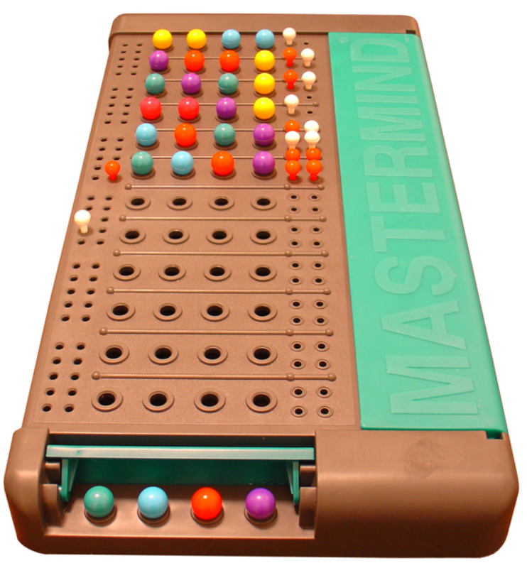

# Mastermind en Prolog
## Présentation du sujet
L'objectif de ce TP est de développer un petit jeu de Mastermind en utilisant le langage de programmation Prolog.

## À propos des prédicats en Prolog
Dans ce projet, nous utiliserons la notation suivante pour définir les prédicats à écrire :

- **p(+In, -Out, ?InOut)**

Voici la signification de chaque symbole :
- **+In** signifie que l'argument In doit être instancié dès l'appel du prédicat p.
- **-Out** signifie que l'argument Out sera instancié par l'appel du prédicat.
- **?** signifie que l'argument peut être instancié avant l'appel ou sera instancié par l'appel.

**NB:**
Ces symboles ne sont pas utilisés par Prolog dans la définition des prédicats et ne doivent donc pas apparaître dans les réponses. Ils sont uniquement utilisés dans l'énoncé à des fins de désambiguïsation.

## Rappel des règles du jeu
```

```

Mastermind est un jeu de stratégie à 2 joueurs. Le but est de deviner un code. Le premier joueur (le codeur) propose un code de N couleurs au deuxième joueur (le décodeur). À chaque proposition du décodeur, le codeur indique :

- Le nombre de couleurs bien placées (noté BP)
- Le nombre de couleurs mal placées (noté MP)
- Les codes sont représentés par des listes d'entiers, les couleurs étant numérotées de 1 à M et la taille des codes étant N.


**Exemples** :
```
- Code initial : [1,2,3,4]
- Code proposé : [1,3,2,3]
- BP : 1 (le premier 1 est bien placé)
- MP : 2 (le premier 3 et le 2 sont mal placés)
```


## Prédicats à implémenter
### Question 1 : Bien placés
1. *nBienPlace(+Code1, +Code2, -BP)*
calcule le nombre de couleurs bien placées.

```
| ?- nBienPlace([1,2,3,4], [1,2,3,5], BP).
BP = 3
```

2. *gagne(+Code1, +Code2)*
- Vérifie que les codes Code1 et Code2 sont identiques. Utilise le prédicat nBienPlace.
- Définir un prédicat longueur(+L, -N) qui donne la longueur N de la liste L. Ce prédicat sera utilisé comme fonction auxilliare pour la bonne marche du prédicat *gagne*.

```
| ?- gagne([1,2,3,4], [1,2,3,4]).
true
```

### Question 2 : Mal placés
1. *element(+E, +L)*
vérifie que l'élément E appartient à la liste L.

```
| ?- element(2, [1,2,3,4]).
true
```

2. *enleve(+E, +L1, -L2)*
construit la liste L2 identique à L1 privée de la première occurrence de E.

```
| ?- enleve(2, [1,2,3,4], L2).
L2 = [1,3,4]
```

3. *enleveBP(+Code1, +Code2, -Code1Bis, -Code2Bis)*
genère Code1Bis et Code2Bis contenant les éléments de Code1 et Code2 privés des éléments bien placés.

```
| ?- enleveBP([1,2,3,4,5,6], [1,2,5,4,3,4], Code1Bis, Code2Bis).
Code1Bis = [3,5,6]
Code2Bis = [5,3,4]

```

4. *nMalPlacesAux(+Code1, +Code2, -MP)*
calcul le nombre d'éléments mal placés pour des listes ne contenant aucuns éléments bien placés communs.

```
| ?- nMalPlacesAux([1,2,3,4], [4,3,2,1], MP).
MP = 4
```


5. *nMalPlaces(+Code1, +Code2, -MP)*
calcule le nombre d'éléments mal placés.

```
| ?- nMalPlaces([1,2,3,4], [1,3,2,3], MP).
MP = 2
```

### Question 3 : Génération de code
- *codeur(+M, +N, -Code)*
produit aléatoirement un code de taille N basé sur M couleurs.
Utilise le prédicat random(+Base, +Max, -Number) pour générer un nombre aléatoire.


### Question 4 : Jouer au Mastermind
- *jouons(+M, +N, +Max)*
    - Permet de jouer à Mastermind en tant que décodeur.
    - Choisit aléatoirement un code de taille N avec au plus M couleurs différentes.
    - Demande à un joueur humain de proposer un code, avec Max essais pour trouver le code.

    ```
    | ?- jouons(5, 4, 6)
    Il reste 6 coup(s).
    Donner un code : [1,2,3,4].
    BP: 0/MP: 2

    Il reste 5 coup(s).
    Donner un code : [2,1,5,1].
    BP: 2/MP: 0

    Il reste 4 coup(s).
    Donner un code : [2,4,1,5].

    BP: 3/MP: 0

    Il reste 3 coup(s).
    Donner un code : [2,4,5,5].
    BP: 4/MP: 0
    Bravo champion !

    ```

## Conclusion
Ce projet met en œuvre plusieurs concepts de Prolog tels que la manipulation des listes, la génération aléatoire et les interactions utilisateur pour créer un jeu de Mastermind fonctionnel. En suivant les étapes et en implémentant les prédicats décrits, vous serez en mesure de jouer à Mastermind directement dans votre environnement Prolog.

**Remarque**
Les questions 4 et 5 de la deuxième partie de MasterMind n'ont pas été traitées.
Aussi ce TP a été réalisé sur l'éditeur SWISH en ligne (raison pour laquelle une explication de comment compiler le programme sur un éditeur installé n'a pas été donnée).